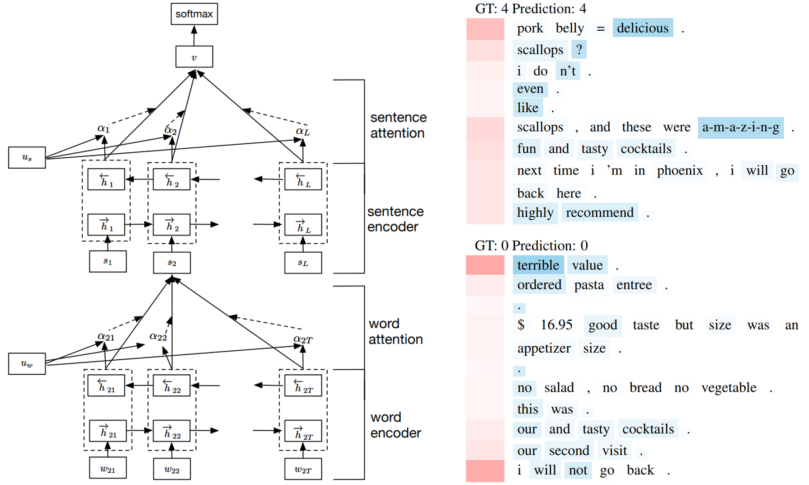

# Hierarchical Attention Networks for Document Classification

This is a TensorFlow-based implementation of the paper [Hierarchical Attention Networks for Document Classification](https://www.cs.cmu.edu/~hovy/papers/16HLT-hierarchical-attention-networks.pdf), NAACL 2016.



## Requirements

- Python 3
- Tensorflow > 1.0
- Pandas
- Nltk
- Tqdm
- [Glove pre-trained word embeddings](http://nlp.stanford.edu/data/glove.6B.zip)


## Data

We use the [data](http://ir.hit.edu.cn/~dytang/paper/emnlp2015/emnlp-2015-data.7z) provided by [Tang et al. 2015](http://ir.hit.edu.cn/~dytang/paper/emnlp2015/emnlp2015.pdf), including 4 datasets:

- IMDB
- Yelp 2013
- Yelp 2014
- Yelp 2015


## Usage

First, download the [datasets](#data) and unzip into `data` folder.
<br>
Then, run script to prepare the data (default is using Yelp-2015 dataset):

```bash
python data_prepare.py
```

Train and evaluate the model:

```bash
python train.py
```

Print hyper-parameters:

```bash
python train.py --help
```

```
optional arguments:
  -h, --help            show this help message and exit
  --cell_dim            CELL_DIM
                        Hidden dimensions of GRU cells (default: 50)
  --att_dim             ATTENTION_DIM
                        Dimensionality of attention spaces (default: 100)
  --emb_dim             EMBEDDING_DIM
                        Dimensionality of word embedding (default: 200)
  --learning_rate       LEARNING_RATE
                        Learning rate (default: 0.0005)
  --max_grad_norm       MAX_GRAD_NORM
                        Maximum value of the global norm of the gradients for clipping (default: 5.0)
  --dropout_rate        DROPOUT_RATE
                        Probability of dropping neurons (default: 0.5)
  --num_classes         NUM_CLASSES
                        Number of classes (default: 5)
  --num_checkpoints     NUM_CHECKPOINTS
                        Number of checkpoints to store (default: 1)
  --num_epochs          NUM_EPOCHS
                        Number of training epochs (default: 20)
  --batch_size          BATCH_SIZE
                        Batch size (default: 64)
  --display_step        DISPLAY_STEP
                        Number of steps to display log into TensorBoard (default: 20)
  --allow_soft_placement ALLOW_SOFT_PLACEMENT
                        Allow device soft device placement
```

## Results